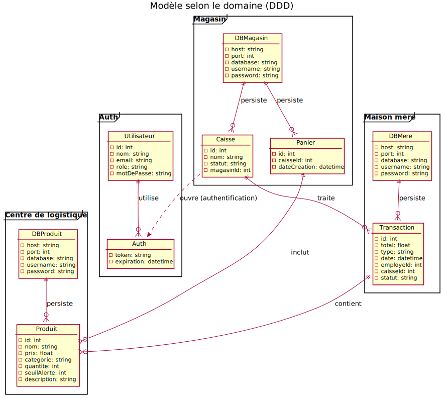
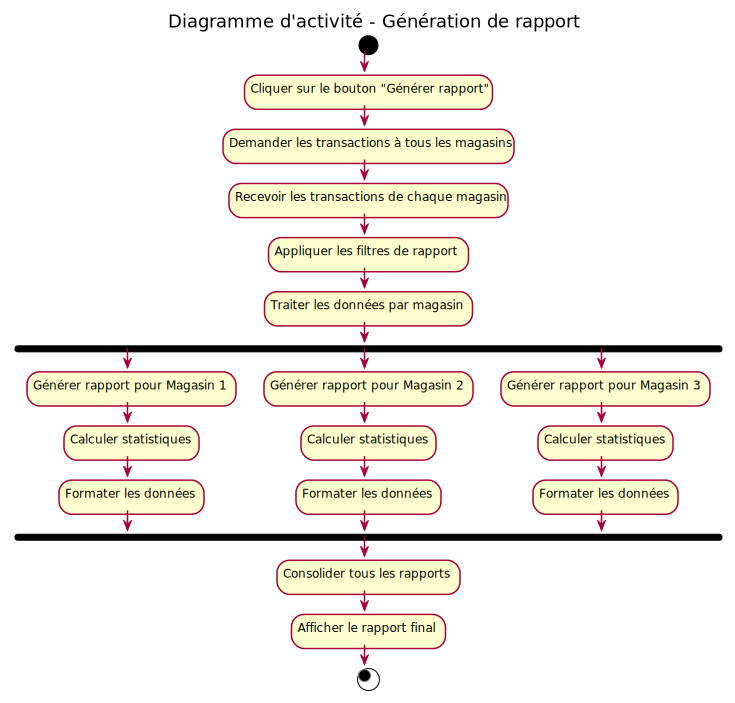
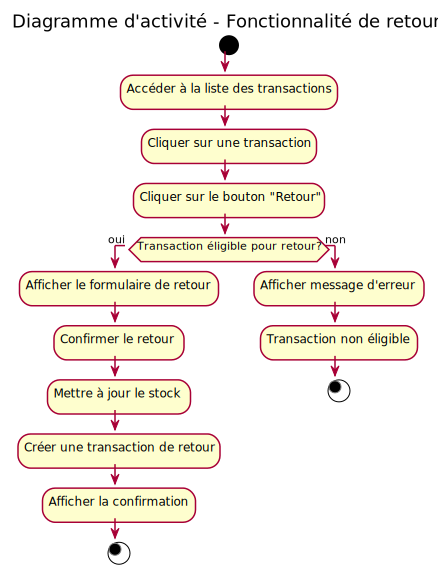
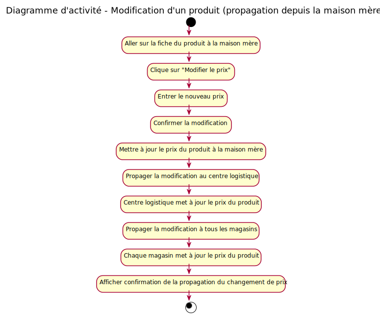
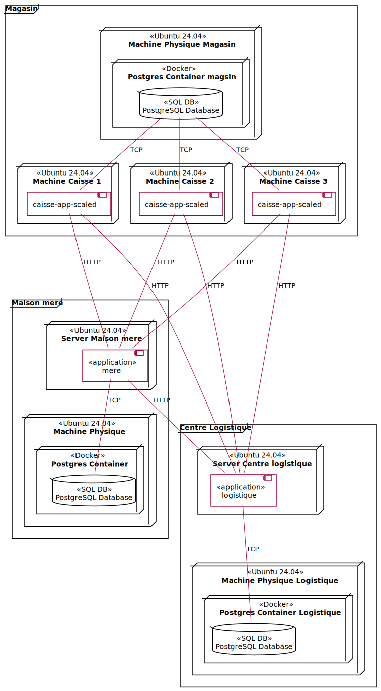

# Documentation de l'Architecture
---
## information préliminaire pour les labos :
- lab 0 : https://github.com/SunnyKentz/labo-0-log430.git -> ce labo est privé mais Achref Samoud à access
- lab 1 : https://github.com/SunnyKentz/labo-1-log430.git
- lab 2 : https://github.com/SunnyKentz/labo-2-log430.git
- lab 3 : https://github.com/SunnyKentz/labo-3-log430.git
- lab 4 : https://github.com/SunnyKentz/labo-4-log430.git

## Introduction et Objectifs
Ce document présente l'architecture d'un système de Magasin développé en Go. Le système est conçu pour gérer les opérations de vente et de retour de produits, de réaprovisionnement et de supervision de magasin dans un environnement distribué. L'architecture suit le modèle 4+1 de Philippe Kruchten, permettant une vue complète du système à travers différentes perspectives : logique, processus, déploiement, implémentation et cas d'utilisation.

Le système utilise une base des données PostgreSQL pour la persistance des données, avec GORM comme ORM pour faciliter les interactions avec la base de données. L'interface utilisateur est un site web. Le tout est conteneurisé avec Docker pour assurer une déploiement cohérent et reproductible.

## Analyse et continuité
- Le labo 0 à permis de crée un server web facile
- le labo 1 à permis de crée l'application POS non distribué
- le labo 2 à fusionner le lab 0 et 1, en fesant un serveur web avec l'application POS
- Le système à été séparrer en plusieurs applications pour répondre au besoin de scale et de séparation de logique du système
- Les nouveaux défis architecturaux sont la communications entre les services et la coordination d'api
- Dans la suite de l'analyse nous verons un diagramme du modèle qui sépare les différents partie du système selon le Domain-Driven Design (DDD)
- Le système à évoluer, il a maintenant un système de micro-service avec 4 services : les magasins, la logistique, la mère, l'authentification

## Stratégie de Solution
#### Proposition d'architecture sous forme de vues UML selon le modèle 4+1
---
- Vue logique :

  

- Vue des processus :

  | Diagramme d'Activité |  |  |
  | ----------------------------------------------------| --------------------------------------------------| -------------------------------------------------------|
  | |  |       |
  |        |        |
- Vue de déploiement :

  

- Vue d'implémentation :
  
  

- Vue des cas d'utilisation :

  

## Les technologies choisies

### Langage de programmation
- **Go (Golang)** : Langage principal pour le développement du système. Choisi pour sa performance, sa simplicité et sa capacité à gérer la concurrence efficacement.

### Base de données
- **PostgreSQL** : Système de gestion de base de données relationnelle robuste et fiable pour la persistance des données.
- **GORM** : ORM (Object-Relational Mapping) pour Go, facilitant les interactions avec la base de données.

### Interface utilisateur
- **HTML** : Pas de framework de frontend utilisé seulement du html

### Conteneurisation et déploiement
- **Docker** : Plateforme de conteneurisation pour assurer un déploiement cohérent et reproductible.
- **Alpine linux** : Système d'exploitation de base pour les conteneurs et serveurs.

### Architecture et modélisation
- **GO Fiber** : Outils de création de serveur http pour Golang

### Communication et API
- **HTTP/REST** : Protocole de communication pour les APIs entre les différents services.

### Logging et monitoring
- **Système de logging personnalisé** : Implémentation d'un logger singleton pour tracer les opérations et erreurs du système.

## Structure du projet

Le projet `caisse_app_scaled` suit une architecture microservices distribuée avec une séparation claire des responsabilités selon le Domain-Driven Design (DDD). La structure est organisée comme suit :

### Services principaux (Microservices)

#### 1. **magasin/** - Service de gestion des magasins
- **Port : 8080**
- **Responsabilités :** Gestion des opérations de caisse, transactions de vente et retour
- **Structure interne :**
  - `api/` : Contrôleurs et routes HTTP pour les opérations de caisse
  - `caissier/` : Logique métier spécifique aux opérations de caissier
  - `db/` : Couche d'accès aux données et proxy de base de données
  - `view/` : Templates HTML pour l'interface utilisateur (checkout, login, produits, transactions)
  - `app.go` : Point d'entrée principal du service

#### 2. **centre_logistique/** - Service de logistique
- **Port : 8091**
- **Responsabilités :** Gestion des commandes, réapprovisionnement et logistique
- **Structure interne :**
  - `api/` : API REST pour les opérations logistiques
  - `logistics/` : Logique métier de gestion logistique
  - `db/` : Accès aux données logistiques
  - `view/` : Interface de gestion des commandes
  - `app.go` : Point d'entrée du service logistique

#### 3. **maison_mere/** - Service de supervision
- **Port : 8090**
- **Responsabilités :** Analytics, rapports, supervision globale et gestion des produits
- **Structure interne :**
  - `api/` : API pour les analytics et rapports
  - `mere/` : Logique métier de supervision
  - `db/` : Accès aux données de reporting
  - `view/` : Dashboards et interfaces d'analytics
  - `app.go` : Point d'entrée du service de supervision

#### 3. **auth/** - Service de supervision
- **Port : 8092**
- **Responsabilités :** l'authentification des employées et clients
- **Structure interne :**
  - `api/` : API pour l'authentification et jwt
  - `authData/` : la logique
  - `app.go` : Point d'entrée du service d'authentification

### Composants partagés

#### 4. **models/** - Modèles de données partagés
- `caisse.go` : Modèle de données pour les caisses
- `employe.go` : Modèle pour les employés
- `magasin.go` : Modèle de magasin
- `produit.go` : Modèle de produits
- `transaction.go` : Modèle de transactions

#### 5. **utils/** - Utilitaires partagés
- `utils.go` : Fonctions utilitaires communes aux services

#### 6. **logger/** - Système de logging centralisé
- `logger.go` : Implémentation d'un logger singleton pour tracer les opérations

## Des instructions d'exécution détaillées

Les instructions d'éxecution sont dans le README.md