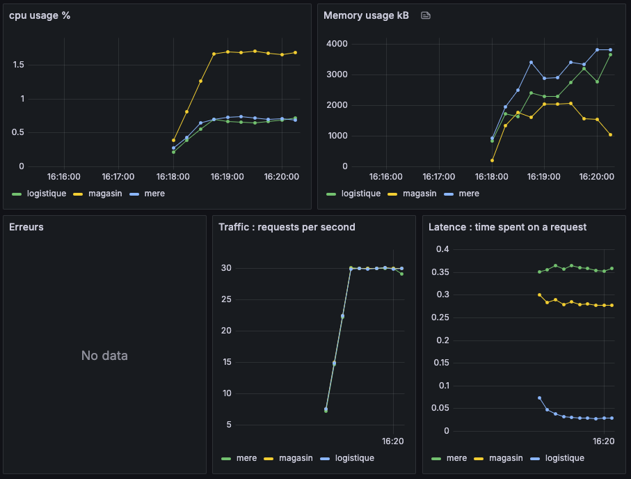

# Rapport du laboratoire 5

Github : https://github.com/SunnyKentz/labo-5-log430.git

## Préambule

Dans le cadre du laboratoire 5, l'ajout de Traefik dans le labo 4 a grandement aidé. Traefik est mon API gateway et mon load balancer.
J'ai aussi ajouté un nouveau service d'authentification avec une nouvelle API
pour enregistrer un client/employé.

## Test de charge initial et observabilité de base

#### Outils choisis : 
Traefik est l'outil choisi pour l'API Gateway

#### Résultats :
Bien que cela était déjà implémenté, mon application n'utilise maintenant qu'un seul endpoint avec des routes différentes pour chaque service.

### Découpage logique du système
- J'avais déjà 3 services, j'en ai ajouté un autre : l'authentification.
    Ce service n'a pas de base de données car je voulais garder ça simple comme demandé.
- Parmi les trois API proposées à ajouter, je n'en ai ajouté qu'une seule car j'avais déjà les autres : une API pour la création de comptes clients.
    Nous pouvons utiliser ces endpoints API pour ajouter un utilisateur : `/mere/api/v1/register` `/auth/api/v1/register`

### Mise en place de l’API Gateway
- J'ai implémenté Traefik comme API Gateway qui me permet d'accéder à tous les services par localhost:80
- Nous pouvons accéder aux services de la façon suivante :
    - `localhost/mere`
    - `localhost/magasin`
    - `localhost/logistique`
    - `localhost/auth`

### Configurer un scénario de load balancing via l’API Gateway
- Traefik est un load balancer que j'avais déjà implémenté dans le laboratoire 4, j'utilise round-robin (par défaut)
- Les tests de charge dans une infrastructure microservices ont déjà été faits dans le laboratoire 4, j'y ferai référence dans ce rapport, car je suis passé à une infrastructure microservices depuis le laboratoire 3

### Sécurité et gestion des accès
- J'ai ajouté une règle CORS pour que seules les origines `localhost` et `172.17.0.1` (adresse interne docker-compose) puissent accéder aux API

### Documentation et tests
- La documentation Swagger a été ajoutée pour auth qui est mon nouveau service et pour mere où j'ai ajouté `mere/api/v1/register`
- Les fichiers swagger.json peuvent être importés dans Postman

### Observabilité et comparaison
- Comme déjà mentionné dans ce laboratoire, depuis le laboratoire 3 je suis passé à une architecture microservices et depuis le laboratoire 4 j'utilise Traefik comme API Gateway, donc les graphiques de comparaison sont déjà faits dans le laboratoire 3. Voici les résultats Grafana qui n'utilisent qu'un seul endpoint :

| RPS = 1 | RPS = 15 | RPS = 30 |
|---------|----------|----------|
|  |  |  |

#### N = 2 instances

| RPS = 1 | RPS = 15 | RPS = 30 |
|---------|----------|----------|
|  |  |  |

#### N = 3 instances

| RPS = 1 | RPS = 15 | RPS = 30 |
|---------|----------|----------|
|  |  |  |

#### N = 4 instances

| RPS = 1 | RPS = 15 | RPS = 30 |
|---------|----------|----------|
|  |  |  |

### Présentez un graphique comparatif

Nous pouvons voir ici que le temps passé sur une requête diminue légèrement grâce au scale du nombre d'instances.  
Mais pas de beaucoup car le véritable ralentissement vient des demandes de lecture et d'écriture à la base de données.

### Test de tolérance aux pannes

Ce test a été fait avec 19 requêtes par seconde et 2 instances 

Ce test a été fait avec 19 requêtes par seconde, réduit à 1 instance

On peut voir que le nombre d'erreurs a augmenté en réduisant le nombre d'instances.
Le service a continué normalement mais avec des erreurs.
Le load balancer a redirigé tout le trafic vers la seule instance qui restait.

### Analyse des stratégies de load balancing

Traefik supporte les algorithmes Round Robin, Least Connections et Weighted Round Robin, mais mon CPU et RAM sont trop faibles pour pouvoir déduire une conclusion en ce qui concerne la différence entre les algorithmes.
Il faudrait que je puisse au moins arriver à 500 req/s

### Documentez les limites observées malgré la répartition de charge.

La répartition de charge peut en effet rendre l'application disponible plus vite mais si les requêtes vers la base de données prennent du temps et qu'il n'y a qu'une seule base de données, le problème de latence ne s'arrange pas.
En effet, dans mes observations, le service de logistique tombe en panne en premier car c'est ce service qui fait le plus de lectures et d'écritures vers la base de données.

## Implémentation d’un cache sur des endpoints critiques

#### Identifiez les endpoints les plus sollicités
 - GET http://localhost/mere/api/v1/raport
 - PUT http://localhost/mere/api/v1/produit
 - GET http://localhost/magasin/api/v1/produits

 #### Ajoutez un mécanisme de cache 

 J'ai ajouté un middleware qui regarde un hashmap et le temps que ça a été mis à jour pour retourner plus rapidement la requête :

 `cache["api/v1/raport"] = JSON{...}`
 `cache["time - api/v1/raport"] = time.Now()`
 Je mets à jour le hashmap à chaque API_Success

#### Configurez les règles d’expiration et d’invalidation : 

Je valide le cache tant que c'est à l'intérieur de 30 sec

`time.Now() - cache["time - api/v1/raport"] > 30 sec`

#### Répétez les tests de charge et comparez les performances :

Ici nous pouvons voir que le système peut supporter facilement 30 req/s avant que la connexion SSH ne tombe.

Ici, nous pouvons voir que les erreurs commencent à apparaître à 70 req/s

- Réduction de la latence des endpoints mis en cache ?
    - Il y a une grande réduction de la latence. Nous pouvons même atteindre 70 req/s avec le cache.
- Diminution de la charge sur la base de données ?
    - Essentiellement, avec un cache de 30 secondes, la base de données est sollicitée 2 fois par seconde. Ce qui est une amélioration pour la latence.
- Évolution de la saturation ? 
    - On peut voir que le niveau d'utilisation de la mémoire RAM a augmenté à cause du cache.

#### Consignez les gains observés et toute limitation
- La limitation principale est que les changements dans les bases de données ne se voient qu'après 30 secondes.
- Nous avons eu un gain de 2x sur le support de requêtes par seconde.